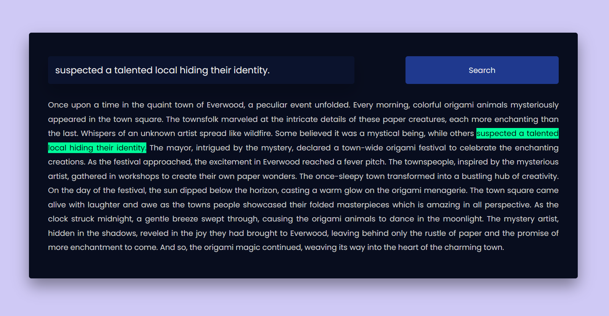

# Highlight Search Text

This repository hosts a JavaScript project focused on enhancing user search experiences by providing a text highlighting feature. Built with HTML, CSS, and JavaScript, the project showcases a modern UI design for seamless integration into web applications.

## Preview



## Features

- **Text Highlighting:** Enhance search results with dynamically highlighted text.
- **Responsive Design:** Ensures optimal user experience across various devices.
- **Modern UI:** Sleek and intuitive design for improved usability.

## Getting Started

To use this Highlight Search Text project in your application, follow these steps:

1. Clone the repository to your local machine:

   ```bash
   git clone https://github.com/Devsethi3/Highlight-Search-Text.git
   ```

2. Include the necessary files in your project:

   - Copy the HTML, CSS, and JavaScript code from the `index.html`, `style.css`, and `script.js` files into your project.
   - Link these files in your HTML file:

     ```html
     <link rel="stylesheet" href="path/to/style.css">
     <script src="path/to/script.js"></script>
     ```

3. Customize the design and integrate the highlight search text functionality into your project.

## Usage

1. Enter a search query in the provided input field.
2. The project will dynamically highlight matching text within the displayed content.

## Customization

Feel free to customize the project according to your application's design. Adjust styles, colors, and layout as needed. Additionally, you can extend the functionality to cater to specific search requirements.

## Contributing

If you'd like to contribute to this project, please follow these steps:

1. Fork the repository.
2. Create a new branch for your feature or improvement.
3. Make your changes and commit them with descriptive messages.
4. Push your changes to your forked repository.
5. Open a pull request to merge your changes into the main branch.

Explore the Highlight Search Text project, provide feedback, and consider contributing to its development. Thank you for checking out the JavaScript Highlight Search Text repository!